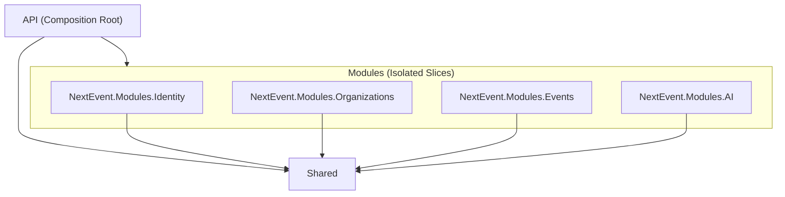

# NextEvent Migration to Modular Monolith

This document outlines the architectural changes, project structure, data flow, cross-module communication, RabbitMQ integration, database query patterns, per-module seeders, and schema migration history for the `NextEvent` application.

## 1. The New Architecture: Modular Monolith

The NextEvent application has been migrated to a **Modular Monolith** architecture. But what does that mean?

In a traditional Layered Monolith (like Onion Architecture), code is grouped by *technical concern*. All database code lives in a giant `Persistence` folder, all business logic in an `Application` folder, and all entities in a `Domain` folder. Over time, these folders become massive, and features become heavily tangled together (Spaghetti Code).

In a **Modular Monolith**, code is grouped by *business feature* (Bounded Contexts) into vertical slices called **Modules**. 
- Each Module (e.g., `Events`, `Organizations`, `Identity`, `AI`) is completely self-contained. It has its own Application logic, Domain entities, and Persistence layer.
- Modules are strictly forbidden from directly calling each other's DbContexts or writing to each other's database tables. 
- When modules need to talk to each other, they publish asynchronous integration events via a message broker (RabbitMQ) using the **Transactional Outbox Pattern**.

This architecture gives you the operational simplicity of deploying a single application (a monolith) while enforcing the strict boundaries and scalability characteristics of **Microservices**.

---

## 2. How to Run the Application

### Prerequisites
- **RabbitMQ**: The application uses MassTransit with RabbitMQ for cross-module event publishing (Transactional Outbox). Ensure you have RabbitMQ running locally. You can start it via Docker:
  ```bash
  docker run -d --name rabbitmq -p 5672:5672 -p 15672:15672 rabbitmq:3-management
  ```

### Starter Project
The **`API`** project is the designated **Starter Project** (Composition Root). 

To start the application, open your terminal at the root of the solution and run:
```bash
dotnet run --project API/API.csproj
```

**What happens on startup:**
1. The API project configures Dependency Injection, pulling in services from all modules.
2. It initializes the database connections.
3. It automatically runs EF Core migrations for all three bounded contexts (`Identity`, `Organizations`, `Events`).
4. It executes the modular per-module seeders (`IdentityDataSeeder`, `OrganizationsDataSeeder`, `EventsDataSeeder`) to inject default roles, admin users, permissions, categories, and initial events in sequence.
5. It spins up the Swagger UI and API endpoints.

---

## 3. What Changes Were Made for the Migration

We transitioned from a traditional Layered (Onion) Monolith to a **Modular Monolith**. Here are the key transformations:

- **Folder Restructuring:** The old monolithic `Domain`, `Application`, and `Persistence` folders were dismantled. Their contents were reorganized into distinct, self-contained vertical slices called **Modules** (`Modules/Identity`, `Modules/Organizations`, `Modules/Events`, `Modules/AI`).
- **Database Segregation:** The monolithic `AppDBContext` was split into three isolated contexts (`IdentityDbContext`, `OrganizationsDbContext`, `EventsDbContext`). Each context is responsible for its own database schema (`identity`, `org`, `evt`).
- **Namespace Standardization:** All namespaces were updated to align with the new structure (e.g., `NextEvent.Modules.Events.Domain`).
- **Shared Kernel Extraction:** Common cross-cutting concerns (Exceptions, base interfaces, generic API responses, Identity models needed across modules) were extracted into a unified `Shared` project.
- **Cross-Module Communication:** Implemented **MassTransit** with RabbitMQ. Instead of modules directly calling each other's database contexts, they publish and subscribe to integration events.
- **Transactional Outbox Pattern:** Added Outbox tables to each module's DbContext. This guarantees that when a module performs a transaction (e.g., creating a user), the subsequent event (`UserCreatedEvent`) is reliably delivered even if the message broker momentarily goes down.
- **Independent Migrations:** Generated separate EF Core migrations for each module, enabling them to evolve their schemas independently.

---

## 4. Cross-Module Communication & Data Flow

Modules communicate in **two ways** depending on whether the operation is **Synchronous (Read Side)** or **Asynchronous (Write Side / State Changes)**:

```
                      ┌─────────────────────────────────────────┐
                      │             Client / Frontend           │
                      └────────────────────┬────────────────────┘
                                           │
                        ┌──────────────────┴──────────────────┐
                        │      API Layer (Program.cs)         │
                        └──────────┬──────────────────┬───────┘
                                   │                  │
               Sync Read (Queries) │                  │ Async Writes (Commands/Events)
               (Dapper Raw SQL)    │                  │ (MassTransit + RabbitMQ)
                                   ▼                  ▼
                        ┌─────────────────────┬─────────────────────┐
                        │   Read Side (CQRS)  │  Write Side (CQRS)  │
                        │  Cross-Schema SQL   │ Transactional Outbox│
                        └─────────────────────┴─────────────────────┘
```

### A. Synchronous Read Communication (Queries - Dapper)
When a user views an Event details page, the UI needs both **Event details** (from `evt` schema) and **Organization details** (from `org` schema).
* Since this is a read-only query, we use **Dapper** with explicit schema prefixes:
  ```sql
  SELECT e.Id, e.Title, o.Name AS OrganizationName
  FROM [evt].[Events] e
  INNER JOIN [org].[Organizations] o ON e.OrganizationId = o.Id
  WHERE e.Id = @EventId
  ```
* **Why**: High performance, zero domain boundary violations (read operations do not mutate state).

---

### B. Asynchronous Write Communication (Domain Events & RabbitMQ)
When an action in one module requires another module to react (e.g., when an **Organization is deleted** or **Role permissions change**), modules **NEVER call each other directly**. Instead, they publish an **Integration Event**.

---

## 5. How RabbitMQ Works in NextEvent

### Fundamental RabbitMQ Concepts:
1. **Publisher**: The sender of an integration event (e.g., `Organizations` module publishing `OrganizationCreatedIntegrationEvent`).
2. **Exchange**: An agent inside RabbitMQ that receives messages from publishers and routes them to queues based on event topic types.
3. **Queue**: A durable buffer/mailbox stored in RabbitMQ memory/disk for subscriber modules.
4. **Consumer**: MassTransit consumer class inside a subscriber module waiting to process incoming messages (e.g., `OrganizationCreatedIntegrationEventConsumer` in `Events` module).

---

## 6. The Transactional Outbox Pattern Workflow

To prevent **dual-write failures** (e.g., database transaction succeeds, but RabbitMQ server crashes before the message is sent), NextEvent implements MassTransit's **Transactional Outbox Pattern**.

```
[ Organizations Module ]                       [ RabbitMQ Broker ]               [ Events Module ]
         │                                              │                                │
1. User deletes Org                                     │                                │
         │                                              │                                │
2. Begin SQL Transaction                                │                                │
   ├─ Delete Org in [org].[Organizations]               │                                │
   └─ Save Event to [org].[OutboxMessages]              │                                │
3. Commit SQL Transaction                               │                                │
         │                                              │                                │
4. MassTransit Outbox Delivery Service                  │                                │
   └─ Polls [org].[OutboxMessages] ────────────────────►│ 5. Publish to Exchange         │
                                                        │  └─ Route to Events Queue ────►│ 6. MassTransit Consumer
                                                        │                                │    Executes business logic
```

### Detailed Execution Steps:
1. **Command Processing**: A request hits a command handler (e.g., `CreateOrganizationCommandHandler`).
2. **Transactional Outbox Persistence**: MassTransit intercepts `_publishEndpoint.Publish()` and **does NOT send it to RabbitMQ immediately**. Instead, it writes a JSON record of the event into the local SQL table `[org].[OutboxMessages]` **inside the exact same SQL transaction** as the organization data.
3. **Guaranteed Delivery**: A background service continuously polls `[org].[OutboxMessages]`. Once the database transaction commits successfully, the worker pushes the message to **RabbitMQ**.
4. **Exchange Routing**: RabbitMQ receives the event in its Exchange and routes it to subscriber queues.
5. **Consumer Execution**: MassTransit inside subscriber modules listens to the queue and executes the event consumer handler.

---

## 7. Per-Module Seeders Architecture

The database seeding logic is split into isolated, **per-module seeders** inside each module's `Persistence/Seeders` folder:

```
Modules/
├── Identity/
│   └── Persistence/Seeders/IdentityDataSeeder.cs       (Seeds roles, users)
├── Organizations/
│   └── Persistence/Seeders/OrganizationsDataSeeder.cs (Seeds permissions)
└── Events/
    └── Persistence/Seeders/EventsDataSeeder.cs        (Seeds categories, sample events)
```

### Data Integrity & Safety Mechanics:
- **100% Idempotency**: Each seeder uses existence checks (`AnyAsync`, `RoleExistsAsync`, `HashSet.Contains`) so running seeding multiple times will never create duplicate rows.
- **Dynamic Foreign Key Resolution**: `EventsDataSeeder` dynamically queries category IDs by unique `Slug` and resolves user IDs from `userManager.FindByNameAsync("member")` to ensure valid foreign keys across schemas.
- **Sequential Execution**: Seeders run in exact dependency order (`IdentityDataSeeder` -> `OrganizationsDataSeeder` -> `EventsDataSeeder`).

---

## 8. How the Folders are Connected (Project Dependencies)

The architecture is designed to enforce modular boundaries. Dependencies flow strictly downwards:



### The Rules of the Architecture
- **`API` (Composition Root)**: References everything. It acts as the glue. It registers the DbContexts, MassTransit, and all module DI services in `Program.cs`. 
- **`Modules/*` (Bounded Contexts)**: 
  - Modules **ONLY** reference `Shared`. 
  - **CRITICAL:** A module is **never** allowed to reference another module. (e.g., `Events` cannot reference `Organizations`). 
  - Each module encapsulates its own Application logic, Domain models, and Persistence layer.
- **`Shared` (Shared Kernel)**: 
  - References nothing else in the application. 
  - Holds shared constants, shared base classes (`Entity`, `BaseApiController`), and the global `User` identity model so that it can be linked via Foreign Keys in other modules' schemas.

---

## 9. Benefits of the Modular Monolith Architecture

1. **High Cohesion & Low Coupling:** Code that changes together lives together inside its own module.
2. **Clear Boundaries & Prevented Spaghetti Code:** Because modules cannot physically reference each other, tight coupling between features is physically impossible.
3. **Independent Scalability & Microservices Readiness:** If a module receives high traffic, it can be extracted into an independent microservice without rewriting application logic or messaging setup.
4. **Safer Migrations:** Database migrations are isolated per schema (`identity`, `org`, `evt`).
5. **Reduced Merge Conflicts:** Teams can work in parallel inside different module folders.

---

## 10. Database Access Strategy & CQRS Pattern

### Why do we access the database using both EF Core and Dapper?
The application implements **Command Query Responsibility Segregation (CQRS)** to optimize both data mutations and read queries:

1. **Write Side (Commands & Business Logic) → Entity Framework Core**:
   - Used for insert, update, and delete operations (e.g., `CreateEventCommand`, `ApproveOrganizationCommand`).
   - Handles unit of work tracking, complex entity validation, optimistic concurrency, domain event dispatching, and MassTransit Transactional Outbox integration.
   - Enforces domain invariants and foreign key constraints before committing changes.

2. **Read Side (Queries & DTO Projections) → Dapper (Raw SQL)**:
   - Used for fetching lists, paginated results, and detail DTOs (e.g., `GetEventsListQueryHandler`, `GetMyOrganizationQueryHandler`).
   - Executes lightweight, parameterized SQL directly against SQL Server with zero change-tracking overhead.
   - Performs multi-schema joins (e.g., joining `[evt].[Events]` with `[org].[Organizations]` and `[identity].[AspNetUsers]`) in a single round-trip using Dapper's `QueryMultipleAsync`.

### Why are explicit schema prefixes required in Dapper queries?
- In Entity Framework Core, the DbContext models specify the default schema (`builder.HasDefaultSchema("evt")` or `builder.HasDefaultSchema("org")`). EF Core automatically prefixes table names in generated SQL queries.
- Raw Dapper queries run directly over `SqlConnection` and bypass EF Core's model builder. If a query uses an unqualified table name like `FROM Events`, SQL Server looks in the connection user's default schema (typically `dbo`), resulting in runtime errors (`Invalid object name 'Events'`).
- **Rule**: All raw SQL queries in Dapper handlers **MUST** explicitly specify schema prefixes (e.g. `[evt].[Events]`, `[evt].[Categories]`, `[org].[Organizations]`, `[identity].[AspNetUsers]`, `[org].[OrganizationRoles]`, `[org].[OrganizationRolePermissions]`, `[org].[Permissions]`).

---

## 11. Database Schema Changes & Migration History

The database has been segregated into three distinct schemas: `identity`, `org`, and `evt`.

### Schemas and Table Breakdown

| Schema | Context | Tables Owned | Description |
| :--- | :--- | :--- | :--- |
| **`identity`** | `IdentityDbContext` | `AspNetUsers`, `AspNetRoles`, `AspNetUserRoles`, `AspNetUserClaims`, `AspNetUserLogins`, `AspNetUserTokens`, `AspNetRoleClaims`, `InboxState`, `OutboxMessage`, `OutboxState` | Core ASP.NET Core Identity authentication tables and Identity module transactional outbox tables. |
| **`org`** | `OrganizationsDbContext` | `Organizations`, `OrganizationMembers`, `OrganizationMemberRoles`, `OrganizationRoles`, `OrganizationRolePermissions`, `Permissions`, `InboxState`, `OutboxMessage`, `OutboxState` | Bounded context for organization management, roles, and fine-grained permissions. |
| **`evt`** | `EventsDbContext` | `Events`, `Categories`, `CategorySuggestions`, `InboxState`, `OutboxMessage`, `OutboxState` | Bounded context for events, categories, and event management. |

---

### Complete Migration History & Alterations

#### 1. Identity Module (`identity` schema)
- **`20260731103059_InitialIdentity`**:
  - Created ASP.NET Core Identity tables: `AspNetUsers`, `AspNetRoles`, `AspNetUserRoles`, `AspNetUserClaims`, `AspNetUserLogins`, `AspNetUserTokens`, `AspNetRoleClaims`.
  - Created initial MassTransit Outbox tables: `InboxState`, `OutboxMessage`, `OutboxState`.
- **`20260731112303_FixMassTransitDowngrade`**:
  - Updated MassTransit Outbox table schema definitions and indexes for MassTransit v8 compatibility.
- **`20260731112656_FixMassTransitDowngrade2`**:
  - Adjusted outbox table column types, index definitions, and sequence constraints.

#### 2. Organizations Module (`org` schema)
- **`20260731111452_InitialOrganizations`**:
  - Created tables: `Organizations`, `OrganizationMembers`, `OrganizationRoles`, `OrganizationRolePermissions`, `OrganizationMemberRoles`, `Permissions`.
  - Created MassTransit Outbox tables in schema `org`: `InboxState`, `OutboxMessage`, `OutboxState`.
- **`20260731112726_FixMassTransitDowngrade2`**:
  - Adjusted outbox schema definitions for `org` context.
- **`20260731114349_FixOrgContextBase`**:
  - Mapped `User` entity to `identity.AspNetUsers` with `ExcludeFromMigrations()` in `OrganizationsDbContext`. This allows foreign key modeling in `org` without duplicating the `AspNetUsers` table in the `org` schema.
- **`20260731114824_FixShadowFKColumns`**:
  - **Altered Foreign Keys & Relationships**: Fixed shadow foreign key columns (`OwnerId`, `CreatedById`, `VerifiedById`, `UpdatedById`) on `Organization` and `OrganizationRole` entities. Explicitly bound navigation properties to existing string FK columns (`OwnerUserId`, `CreatedByUserId`, `VerifiedByUserId`, `UpdatedByUserId`) to prevent EF Core from auto-generating duplicate shadow FK columns across schemas.
- **`20260731115919_FixOrgMemberFKColumns`**:
  - **Altered Columns**: Corrected `OrganizationMember` foreign key column types and nullability constraints.

#### 3. Events Module (`evt` schema)
- **`20260731103959_InitialEvents`**:
  - Created tables: `Events`, `Categories`, `CategorySuggestions`.
  - Created MassTransit Outbox tables in schema `evt`: `InboxState`, `OutboxMessage`, `OutboxState`.
- **`20260731112753_FixMassTransitDowngrade2`**:
  - Adjusted outbox schema definitions for `evt` context.
- **`20260731113808_FixUserTableMapping`**:
  - Configured `User` entity in `EventsDbContext` to reference `identity.AspNetUsers` with `ExcludeFromMigrations()`, preventing duplicate `AspNetUsers` table creation in the `evt` schema.
- **`20260731113922_FixUserTableMapping2`**:
  - Refined table mapping and foreign key constraints for read-only user references in `evt`.
