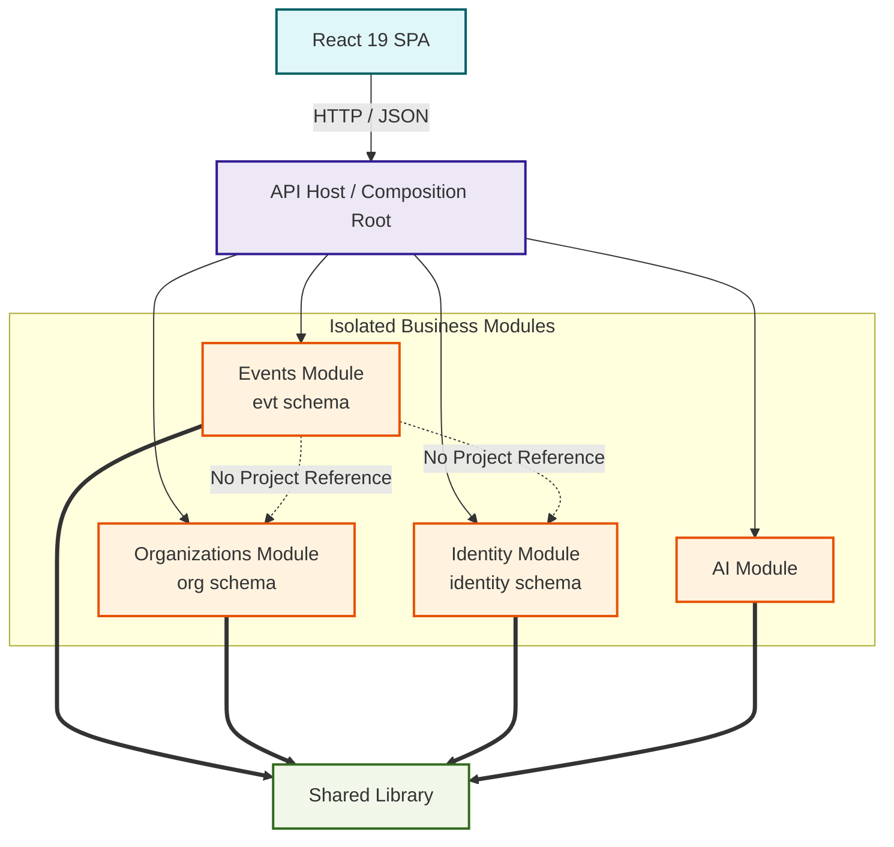
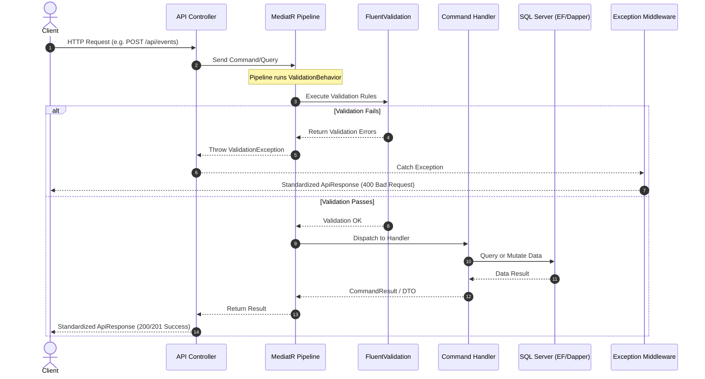

# Architecture Guide

## 1. Solution Structure

```
NextEvent/
├── API/                    # ASP.NET Core Web API — Composition Root
├── Modules/
│   ├── Events/             # Events, Categories, CategorySuggestions, EventReports
│   ├── Organizations/      # Organizations, Members, Roles, Permissions
│   ├── Identity/           # Users, Auth, JWT, RefreshToken, SwitchProfile
│   └── AI/                 # Gemini Pro description generation
├── Shared/                 # Cross-cutting library (exceptions, pagination, constants)
└── client/                 # React 19 + TypeScript + Vite 8 SPA
```

Each module follows **Clean Architecture**: `Domain → Application → Persistence → API`.
Modules share the same SQL Server database but use **isolated schemas** (`evt`, `org`, `identity`).

### Architecture Dependency Map



---

## 2. Backend Architecture

### 2.1 Modular Monolith
Every business domain lives in its own self-contained module under `Modules/`.

- **Isolated DbContexts**: `EventsDbContext`, `OrganizationsDbContext`, `IdentityDbContext` — each owns its schema and migrations independently.
- **Cross-Schema Navigation**: Cross-module FK relationships (e.g. `Event.OrganizationId → org.Organizations`) are mapped using `.ToTable(..., t => t.ExcludeFromMigrations())` — allowing EF Core navigation without duplicate migration scripts.
- **Multi-Assembly DI**: MediatR handlers, FluentValidation validators, and Swagger XML comments are registered dynamically by scanning all module assemblies at startup.

### 2.2 CQRS with MediatR
Controllers never contain business logic. Every request is dispatched via `IMediator`:
- **Commands** — mutate state: `CreateEvent`, `EditEvent`, `DeleteEvent`, `SuspendEvent`, `UnsuspendEvent`, `ReportEvent`, `CreateOrganization`, `ApproveOrganization`, `InviteOrganizationMember`, `AcceptOrganizationInvitation`, `Login`, `Register`, `SwitchProfile`, etc.
- **Queries** — read state: `GetEventsList`, `GetMyEventsList`, `GetAdminEventsList`, `GetEventDetailsById`, `GetEventReports`, `GetMyOrganization`, `GetOrganizationMembers`, `GetMyInvitations`, `GetUsersQuery`, etc.

### 2.3 MediatR Pipeline Behaviors
Requests pass through behaviors before reaching handlers:
1. **`ValidationBehavior<TRequest, TResponse>`** — runs registered FluentValidation validators. Throws `ValidationException` on failure. Handlers never see invalid data.

### Request Lifecycle Flow



### 2.4 Security Architecture

#### BFLA Prevention (Broken Function Level Authorization)
All organizer mutation endpoints are gated at the controller level with `[Authorize(Policy = "ActiveOrganizer")]`. This requires both the `Organizer` ASP.NET Identity role AND the `Organizer` active profile claim in the JWT — instantly rejecting members or anonymous callers before any handler logic executes.

#### BOLA Prevention (Broken Object Level Authorization)
Mutation handlers (`EditEvent`, `DeleteEvent`, etc.) do **not** trust user-provided organization IDs. They load the target resource from the database, extract its true `OrganizationId`, and verify the caller's permissions against that — preventing cross-tenant manipulation.

#### Tenant Isolation
List endpoints like `GET /events/my` inherently scope queries to the caller's organization, ignoring any malicious query parameters attempting to cross tenant boundaries.

#### Suspended Event Security
`GET /events/{id}` returns `404 Not Found` (not `403`) for suspended events when accessed by non-admin, non-organizer callers. This prevents resource enumeration while giving admins and the owning organizer full visibility.

#### Event Reporting Constraints
- Users who belong to an organization cannot report events (e.g., to prevent competitors from falsely flagging events).
- The same user cannot report an event multiple times (enforced in business logic and via a unique database index `UX_EventReports_Event_Reporter`).

#### Organization Owner Protections
The system specifically protects the `Owner` role. Handlers ensure that the original owner of an organization cannot accidentally or maliciously have their `Owner` system role removed, and permission caches are eagerly invalidated upon any role updates.

#### Pagination Guardrails
All list queries use `PaginationParams`, which strictly enforces a minimum `PageSize` of 1 (defaulting to 10 if a value less than 1 is provided), preventing negative offset queries or division-by-zero errors in the database.

#### Network & Transport Security
- **Proxy Support**: The API uses `UseForwardedHeaders` to correctly resolve client IPs and schemes when running behind a reverse proxy (e.g., Nginx, Cloudflare).
- **HSTS**: `UseHsts()` and `UseHttpsRedirection()` are strictly enforced in production to ensure secure transport.

### 2.5 Profile Isolation (ActiveProfile)
Users maintain an `ActiveProfile` state (`"Member"` or `"Organizer"`) stored on the User entity and embedded as a JWT claim. The `ActiveOrganizer` authorization policy requires both the Organizer role AND the Organizer profile claim. Profile switching via `POST /account/switch-profile` issues a fresh JWT without requiring multiple accounts.

### 2.6 Date & Time Convention
- **Time Abstraction**: Across all command handlers and controllers, `DateTime.UtcNow` is never used directly. Instead, an injected `IDateTimeProvider` is used. This is a best practice that makes time-dependent logic deterministically unit-testable.
- All timestamps stored in UTC as `datetime2(3)` (millisecond precision — saves 2 bytes vs default precision 7).
- Business event dates store the UTC point-in-time (`Date`) plus an IANA timezone ID (`TimeZoneId`) separately.
- A global EF Core `UtcDateTimeConverter` and Dapper `UtcDateTimeHandler` force `DateTimeKind.Utc` on all dates read from the database, guaranteeing the `Z` suffix in all JSON responses.
- The frontend derives local display time client-side using `Date + TimeZoneId`.

### 2.7 Optimistic Concurrency
`Organizations` uses a `rowversion` column as a concurrency token. EF Core automatically includes it in UPDATE/DELETE WHERE clauses, throwing `DbUpdateConcurrencyException` on conflicts.

### 2.8 Global Exception Handling
`ExceptionMiddleware` wraps the entire pipeline in a `try/catch` and maps domain exceptions to HTTP responses:

| Exception | HTTP Status |
|---|---|
| `ValidationException` | `400 Bad Request` |
| `UnauthorizedException` | `401 Unauthorized` |
| `NotFoundException` | `404 Not Found` |
| `BusinessRuleException` | `409 Conflict` |
| Unhandled `Exception` | `500 Internal Server Error` |

All responses use the `ApiResponse<T>` envelope: `{ success, message, data, errors }`.

### 2.9 Rate Limiting
- Auth endpoints (`/account/register`, `/account/login`, `/account/refresh-token`) are protected with the `"Auth"` rate limiting policy via `[EnableRateLimiting("Auth")]`.
- Event reporting endpoints (`POST /events/{id}/report`) are protected with the `"Reports"` rate limiting policy (10 requests per 10 minutes) to prevent abuse or spamming.

---

## 3. Frontend Architecture

### 3.1 Routing — React Router v7 Data Router
Each portal owns its route configuration:
- `app/(public)/routes.tsx` — Home, Event Detail, Organization Profile
- `app/organizer/routes.tsx` — Dashboard, Create/Edit Event, Roles, Organization Settings
- `app/admin/routes.tsx` — Admin Dashboard, Events, Organizations, Categories

The global router composes these into a protected top-level tree.

### 3.2 Authorization Guards
- `<RequireRole role="Admin" />` — redirects non-admins
- `<RequireProfile profile="Organizer" />` — redirects non-organizers
- `<RequirePermission permission="events.create" />` — checks granular org permission

### 3.3 Data Fetching — TanStack Query (React Query v5)
26 custom hooks in `shared/hooks/` cover all API interactions. Hooks are strictly scoped by bounded context:

| Hook | Scope |
|---|---|
| `useEvents` | Public event listing (Home only — disabled on other pages) |
| `useMyEvents` | Organizer's own events |
| `useAdminEvents` | Admin all-events view |
| `useEventDetail` | Single event detail (`retry: false` to prevent 404 hammering) |
| `useSuspendEvent` / `useUnsuspendEvent` | Admin event moderation |
| `useEventReports` | Admin view of reports per event |
| `useReportEvent` | Member event reporting |
| `useMyOrganization` | Only enabled when `activeProfile === "Organizer"` |
| `useOrganizationMembers` | Members list + role mutations |
| `useUsers` | Admin view of all platform users and registrations |

### 3.4 Layout Optimization
`PublicLayout` only fetches events and renders the `RightSidebar` (Upcoming Events widget) when `pathname === "/"`. All other public pages (Login, Event Details, Organization Profile) get a clean, full-width layout with zero redundant API calls.

### 3.5 Form Handling — Frontend Diffing & Optimization
- Edit forms (Event Updates, Role Management) diff the current values against `defaultValues` and send only the changed fields. The backend handles these as true partial updates — omitted fields are not touched.
- For dynamic form updates, `useWatch` is preferred over `watch()` from `react-hook-form` to isolate re-renders to specific UI components rather than re-rendering the entire form on every keystroke.

### 3.6 Internationalization (i18next)
Full `react-i18next` setup. Zod validation schemas are dynamically regenerated on language switch to immediately reflect localized error messages.

### 3.7 Theming
Dark/Light mode via `next-themes` + Tailwind CSS v4 CSS variables. Respects system preferences and persists the user's manual selection.

---

## 4. Infrastructure

### Docker Compose Services
| Service | Image | Port |
|---|---|---|
| `sqlserver` | `mcr.microsoft.com/mssql/server:2022-latest` | `1433` |
| `rabbitmq` | `rabbitmq:3-management` | `5672`, `15672` |
| `redis` | `redis:7-alpine` | `6379` |
| `api` | Custom multi-stage .NET build | `5000` |
| `client` | Custom multi-stage Nginx build | `3000` |

The API container waits for SQL Server health before starting. Database migrations and seeding run automatically on startup via `Program.cs`.

### Messaging — MassTransit
MassTransit with the **Transactional Outbox Pattern** is configured per DbContext (`EventsDbContext`, `OrganizationsDbContext`). Messages are written to the outbox table within the same database transaction, guaranteeing at-least-once delivery even if RabbitMQ is temporarily unavailable.
