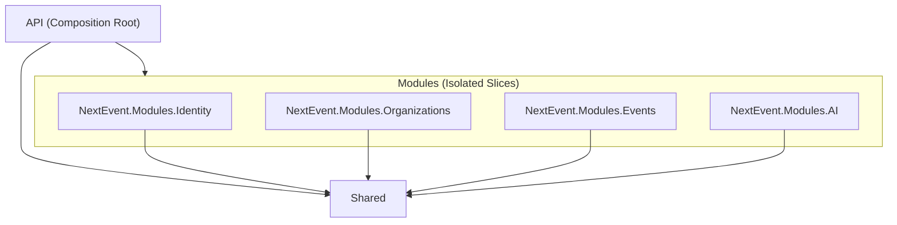

# NextEvent Migration to Modular Monolith

This document outlines the architectural changes, project structure, data flow, cross-module communication, RabbitMQ integration, database query patterns, per-module seeders, and schema migration history for the `NextEvent` application.

## 1. The New Architecture: Modular Monolith

The NextEvent application has been migrated to a **Modular Monolith** architecture. But what does that mean?

In a traditional Layered Monolith (like Onion Architecture), code is grouped by *technical concern*. All database code lives in a giant `Persistence` folder, all business logic in an `Application` folder, and all entities in a `Domain` folder. Over time, these folders become massive, and features become heavily tangled together (Spaghetti Code).

In a **Modular Monolith**, code is grouped by *business feature* (Bounded Contexts) into vertical slices called **Modules**. 
- Each Module (e.g., `Events`, `Organizations`, `Identity`, `AI`) is completely self-contained. It has its own Application logic, Domain entities, and Persistence layer.
- Modules are strictly forbidden from directly calling each other's DbContexts or writing to each other's database tables. 
- When modules need to talk to each other, they publish asynchronous integration events via a message broker (RabbitMQ) using the **Transactional Outbox Pattern**.

This architecture gives you the operational simplicity of deploying a single application (a monolith) while enforcing the strict boundaries and scalability characteristics of **Microservices**.

---

## 2. How to Run the Application

### Prerequisites
- **RabbitMQ**: The application uses MassTransit with RabbitMQ for cross-module event publishing (Transactional Outbox). Ensure you have RabbitMQ running locally.
- **Redis**: The application uses Redis for permission caching (`IPermissionCacheService`). Ensure Redis is running locally.

Both infrastructure services are pre-configured in `docker-compose.yml`. Start them with:
  ```bash
  docker-compose up -d
  ```

### Starter Project
The **`API`** project is the designated **Starter Project** (Composition Root). 

To start the application, open your terminal at the root of the solution and run:
```bash
dotnet run --project API/API.csproj
```

**What happens on startup:**
1. The API project configures Dependency Injection, pulling in services from all modules.
2. It initializes the database connections.
3. It automatically runs EF Core migrations for all three bounded contexts (`Identity`, `Organizations`, `Events`).
4. It executes the modular per-module seeders (`IdentityDataSeeder`, `OrganizationsDataSeeder`, `EventsDataSeeder`) to inject default roles, admin users, permissions, categories, and initial events in sequence.
5. It spins up the Swagger UI and API endpoints.

---

## 3. What Changes Were Made for the Migration

We transitioned from a traditional Layered (Onion) Monolith to a **Modular Monolith**. Here are the key transformations:

- **Folder Restructuring:** The old monolithic `Domain`, `Application`, and `Persistence` folders were dismantled. Their contents were reorganized into distinct, self-contained vertical slices called **Modules** (`Modules/Identity`, `Modules/Organizations`, `Modules/Events`, `Modules/AI`).
- **Database Segregation:** The monolithic `AppDBContext` was split into three isolated contexts (`IdentityDbContext`, `OrganizationsDbContext`, `EventsDbContext`). Each context is responsible for its own database schema (`identity`, `org`, `evt`).
- **Namespace Standardization:** All namespaces were updated to align with the new structure (e.g., `NextEvent.Modules.Events.Domain`).
- **Shared Kernel Extraction:** Common cross-cutting concerns (Exceptions, base interfaces, generic API responses, Identity models needed across modules) were extracted into a unified `Shared` project.
- **Cross-Module Communication:** Implemented **MassTransit** with RabbitMQ. Instead of modules directly calling each other's database contexts, they publish and subscribe to integration events.
- **Transactional Outbox Pattern:** Added Outbox tables to each module's DbContext. This guarantees that when a module performs a transaction (e.g., creating a user), the subsequent event (`UserCreatedEvent`) is reliably delivered even if the message broker momentarily goes down.
- **Independent Migrations:** Generated separate EF Core migrations for each module, enabling them to evolve their schemas independently.

---

## 4. Cross-Module Communication & Data Flow

Modules communicate in **two ways** depending on whether the operation is **Synchronous (Read Side)** or **Asynchronous (Write Side / State Changes)**:

```
                      ┌─────────────────────────────────────────┐
                      │             Client / Frontend           │
                      └────────────────────┬────────────────────┘
                                           │
                        ┌──────────────────┴──────────────────┐
                        │      API Layer (Program.cs)         │
                        └──────────┬──────────────────┬───────┘
                                   │                  │
               Sync Read (Queries) │                  │ Async Writes (Commands/Events)
               (Dapper Raw SQL)    │                  │ (MassTransit + RabbitMQ)
                                   ▼                  ▼
                        ┌─────────────────────┬─────────────────────┐
                        │   Read Side (CQRS)  │  Write Side (CQRS)  │
                        │  Cross-Schema SQL   │ Transactional Outbox│
                        └─────────────────────┴─────────────────────┘
```

### A. Synchronous Read Communication (Queries - Dapper)
When a user views an Event details page, the UI needs both **Event details** (from `evt` schema) and **Organization details** (from `org` schema).
* Since this is a read-only query, we use **Dapper** with explicit schema prefixes:
  ```sql
  SELECT e.Id, e.Title, o.Name AS OrganizationName
  FROM [evt].[Events] e
  INNER JOIN [org].[Organizations] o ON e.OrganizationId = o.Id
  WHERE e.Id = @EventId
  ```
* **Why**: High performance, zero domain boundary violations (read operations do not mutate state).

---

### B. Asynchronous Write Communication (Domain Events & RabbitMQ)
When an action in one module requires another module to react (e.g., when an **Organization is deleted** or **Role permissions change**), modules **NEVER call each other directly**. Instead, they publish an **Integration Event**.

---

## 5. How RabbitMQ Works in NextEvent

### Fundamental RabbitMQ Concepts:
1. **Publisher**: The sender of an integration event (e.g., `Organizations` module publishing `OrganizationCreatedIntegrationEvent`).
2. **Exchange**: An agent inside RabbitMQ that receives messages from publishers and routes them to queues based on event topic types.
3. **Queue**: A durable buffer/mailbox stored in RabbitMQ memory/disk for subscriber modules.
4. **Consumer**: MassTransit consumer class inside a subscriber module waiting to process incoming messages (e.g., `OrganizationCreatedIntegrationEventConsumer` in `Events` module).

---

## 6. The Transactional Outbox Pattern Workflow

To prevent **dual-write failures** (e.g., database transaction succeeds, but RabbitMQ server crashes before the message is sent), NextEvent implements MassTransit's **Transactional Outbox Pattern**.

```
[ Organizations Module ]                       [ RabbitMQ Broker ]               [ Events Module ]
         │                                              │                                │
1. User deletes Org                                     │                                │
         │                                              │                                │
2. Begin SQL Transaction                                │                                │
   ├─ Delete Org in [org].[Organizations]               │                                │
   └─ Save Event to [org].[OutboxMessages]              │                                │
3. Commit SQL Transaction                               │                                │
         │                                              │                                │
4. MassTransit Outbox Delivery Service                  │                                │
   └─ Polls [org].[OutboxMessages] ────────────────────►│ 5. Publish to Exchange         │
                                                        │  └─ Route to Events Queue ────►│ 6. MassTransit Consumer
                                                        │                                │    Executes business logic
```

### Detailed Execution Steps:
1. **Command Processing**: A request hits a command handler (e.g., `CreateOrganizationCommandHandler`).
2. **Transactional Outbox Persistence**: MassTransit intercepts `_publishEndpoint.Publish()` and **does NOT send it to RabbitMQ immediately**. Instead, it writes a JSON record of the event into the local SQL table `[org].[OutboxMessages]` **inside the exact same SQL transaction** as the organization data.
3. **Guaranteed Delivery**: A background service continuously polls `[org].[OutboxMessages]`. Once the database transaction commits successfully, the worker pushes the message to **RabbitMQ**.
4. **Exchange Routing**: RabbitMQ receives the event in its Exchange and routes it to subscriber queues.
5. **Consumer Execution**: MassTransit inside subscriber modules listens to the queue and executes the event consumer handler.

---

## 7. Per-Module Seeders Architecture

The database seeding logic is split into isolated, **per-module seeders** inside each module's `Persistence/Seeders` folder:

```
Modules/
├── Identity/
│   └── Persistence/Seeders/IdentityDataSeeder.cs       (Seeds roles, users)
├── Organizations/
│   └── Persistence/Seeders/OrganizationsDataSeeder.cs (Seeds permissions)
└── Events/
    └── Persistence/Seeders/EventsDataSeeder.cs        (Seeds categories, sample events)
```

### Data Integrity & Safety Mechanics:
- **100% Idempotency**: Each seeder uses existence checks (`AnyAsync`, `RoleExistsAsync`, `HashSet.Contains`) so running seeding multiple times will never create duplicate rows.
- **Dynamic Foreign Key Resolution**: `EventsDataSeeder` dynamically queries category IDs by unique `Slug` and resolves user IDs from `userManager.FindByNameAsync("member")` to ensure valid foreign keys across schemas.
- **Sequential Execution**: Seeders run in exact dependency order (`IdentityDataSeeder` -> `OrganizationsDataSeeder` -> `EventsDataSeeder`).

---

## 8. How the Folders are Connected (Backend Project Dependencies)

The architecture is designed to enforce strict modular boundaries. Dependencies flow strictly downwards:

```
                             ┌─────────────────────────┐
                             │    API (Starter App)    │
                             │    Composition Root     │
                             └────────────┬────────────┘
                                          │
            ┌─────────────────────────────┼─────────────────────────────┐
            │                             │                             │
            ▼                             ▼                             ▼
  ┌───────────────────┐         ┌───────────────────┐         ┌───────────────────┐
  │ NextEvent.Modules.│         │ NextEvent.Modules.│         │ NextEvent.Modules.│
  │     Identity      │         │   Organizations   │         │      Events       │
  └─────────┬─────────┘         └─────────┬─────────┘         └─────────┬─────────┘
            │                             │                             │
            └─────────────────────────────┼─────────────────────────────┘
                                          │
                                          ▼
                             ┌─────────────────────────┐
                             │    NextEvent.Shared     │
                             │     (Shared Kernel)     │
                             └─────────────────────────┘
```



### The 4 Fundamental Rules of Project Dependencies

1. **Rule 1: Dependencies Flow Strictly Downwards (`API` $\rightarrow$ `Modules` $\rightarrow$ `Shared`)**
   - Higher-level projects depend on lower-level projects. Lower-level projects never depend on higher-level projects.

2. **Rule 2: `API` (Composition Root) References Everything**
   - **Dependencies**: `API` $\rightarrow$ `Modules.Identity`, `Modules.Organizations`, `Modules.Events`, `Modules.AI`, `Shared`.
   - **Role**: `API` is the executable project (`Program.cs`). It acts as the "glue" that wires up Dependency Injection (DI), HTTP controllers, MassTransit, Swagger, and EF Core DbContexts for all modules at application startup.

3. **Rule 3: Modules NEVER Reference Each Other**
   - **Strict Constraint**: `NextEvent.Modules.Events` is **never** allowed to reference `NextEvent.Modules.Organizations` or `NextEvent.Modules.Identity`.
   - **Why**: Prevents tight coupling and spaghetti code. If `Events` referenced `Organizations` directly in C#, extracting a module into an independent microservice later would be impossible without rewriting application logic.

4. **Rule 4: `Shared` (Shared Kernel) References Nothing**
   - **Dependencies**: `Shared` $\rightarrow$ None.
   - **Role**: Holds common cross-cutting concerns:
     - Shared Exceptions (`NotFoundException`, `BusinessRuleException`)
     - Generic API response wrappers (`ApiResponse<T>`)
     - Shared Constants (`RoleConstants`, `PermissionConstants`)
     - Global Dapper Type Handlers (`UtcDateTimeHandler`)
     - Base classes (`BaseApiController`, `ValidationBehavior`)
     - The global `User` identity model so foreign key navigation properties can be mapped across module schemas.

---

### How Modules Communicate Without Direct Dependencies

Since modules cannot directly reference each other in C#, they interact through two distinct patterns depending on the CQRS side:

1. **Asynchronous Writes & State Changes (RabbitMQ / MassTransit Integration Events)**:
   - When an action in `Organizations` requires `Events` to react (e.g. an organization is deleted or suspended):
   - `Organizations` publishes an `OrganizationDeletedIntegrationEvent` to **RabbitMQ** via MassTransit.
   - `Events` listens to the event queue via an event consumer and updates its internal state asynchronously.
   - MassTransit **Transactional Outbox** guarantees message delivery even if RabbitMQ experiences temporary downtime.

2. **Synchronous Reads (CQRS Query Side - Dapper Raw SQL)**:
   - When a UI page needs to fetch an Event along with its Organization name:
   - The query handler inside `Events` uses **Dapper** to execute raw SQL joining `[evt].[Events]` with `[org].[Organizations]`.
   - Read-only queries do not mutate domain state, so cross-schema SQL joins provide high performance with zero domain boundary violations.

---

## 9. Benefits of the Modular Monolith Architecture

1. **High Cohesion & Low Coupling:** Code that changes together lives together inside its own module.
2. **Clear Boundaries & Prevented Spaghetti Code:** Because modules cannot physically reference each other, tight coupling between features is physically impossible.
3. **Independent Scalability & Microservices Readiness:** If a module receives high traffic, it can be extracted into an independent microservice without rewriting application logic or messaging setup.
4. **Safer Migrations:** Database migrations are isolated per schema (`identity`, `org`, `evt`).
5. **Reduced Merge Conflicts:** Teams can work in parallel inside different module folders.

---

## 10. Database Access Strategy & CQRS Pattern

### Why do we access the database using both EF Core and Dapper?
The application implements **Command Query Responsibility Segregation (CQRS)** to optimize both data mutations and read queries:

1. **Write Side (Commands & Business Logic) → Entity Framework Core**:
   - Used for insert, update, and delete operations (e.g., `CreateEventCommand`, `ApproveOrganizationCommand`).
   - Handles unit of work tracking, complex entity validation, optimistic concurrency, domain event dispatching, and MassTransit Transactional Outbox integration.
   - Enforces domain invariants and foreign key constraints before committing changes.

2. **Read Side (Queries & DTO Projections) → Dapper (Raw SQL)**:
   - Used for fetching lists, paginated results, and detail DTOs (e.g., `GetEventsListQueryHandler`, `GetMyOrganizationQueryHandler`).
   - Executes lightweight, parameterized SQL directly against SQL Server with zero change-tracking overhead.
   - Performs multi-schema joins (e.g., joining `[evt].[Events]` with `[org].[Organizations]` and `[identity].[AspNetUsers]`) in a single round-trip using Dapper's `QueryMultipleAsync`.

### Why are explicit schema prefixes required in Dapper queries?
- In Entity Framework Core, the DbContext models specify the default schema (`builder.HasDefaultSchema("evt")` or `builder.HasDefaultSchema("org")`). EF Core automatically prefixes table names in generated SQL queries.
- Raw Dapper queries run directly over `SqlConnection` and bypass EF Core's model builder. If a query uses an unqualified table name like `FROM Events`, SQL Server looks in the connection user's default schema (typically `dbo`), resulting in runtime errors (`Invalid object name 'Events'`).
- **Rule**: All raw SQL queries in Dapper handlers **MUST** explicitly specify schema prefixes (e.g. `[evt].[Events]`, `[evt].[Categories]`, `[org].[Organizations]`, `[identity].[AspNetUsers]`, `[org].[OrganizationRoles]`, `[org].[OrganizationRolePermissions]`, `[org].[Permissions]`).

---

## 11. Database Schema Changes & Migration History

The database has been segregated into three distinct schemas: `identity`, `org`, and `evt`.

### Schemas and Table Breakdown

| Schema | Context | Tables Owned | Description |
| :--- | :--- | :--- | :--- |
| **`identity`** | `IdentityDbContext` | `AspNetUsers`, `AspNetRoles`, `AspNetUserRoles`, `AspNetUserClaims`, `AspNetUserLogins`, `AspNetUserTokens`, `AspNetRoleClaims`, `InboxState`, `OutboxMessage`, `OutboxState` | Core ASP.NET Core Identity authentication tables and Identity module transactional outbox tables. |
| **`org`** | `OrganizationsDbContext` | `Organizations`, `OrganizationMembers`, `OrganizationMemberRoles`, `OrganizationRoles`, `OrganizationRolePermissions`, `Permissions`, `InboxState`, `OutboxMessage`, `OutboxState` | Bounded context for organization management, roles, and fine-grained permissions. |
| **`evt`** | `EventsDbContext` | `Events`, `Categories`, `CategorySuggestions`, `InboxState`, `OutboxMessage`, `OutboxState` | Bounded context for events, categories, and event management. |

---

### Complete Migration History & Alterations

#### 1. Identity Module (`identity` schema)
- **`20260731103059_InitialIdentity`**:
  - Created ASP.NET Core Identity tables: `AspNetUsers`, `AspNetRoles`, `AspNetUserRoles`, `AspNetUserClaims`, `AspNetUserLogins`, `AspNetUserTokens`, `AspNetRoleClaims`.
  - Created initial MassTransit Outbox tables: `InboxState`, `OutboxMessage`, `OutboxState`.
- **`20260731112303_FixMassTransitDowngrade`**:
  - Updated MassTransit Outbox table schema definitions and indexes for MassTransit v8 compatibility.
- **`20260731112656_FixMassTransitDowngrade2`**:
  - Adjusted outbox table column types, index definitions, and sequence constraints.
- **`20260801074730_RestoreUserConstraints`**:
  - **Restored User Entity Configuration**: Created `UserConfiguration` and configured property bounds (`DisplayName` max 160, `Bio` max 500, `ImageUrl` max 2048, `RefreshToken` max 256, `ActiveProfile` max 30 default `"Member"`, `RefreshTokenExpiryTime` `datetime2(3)`).

#### 2. Organizations Module (`org` schema)
- **`20260731111452_InitialOrganizations`**:
  - Created tables: `Organizations`, `OrganizationMembers`, `OrganizationRoles`, `OrganizationRolePermissions`, `OrganizationMemberRoles`, `Permissions`.
  - Created MassTransit Outbox tables in schema `org`: `InboxState`, `OutboxMessage`, `OutboxState`.
- **`20260731112726_FixMassTransitDowngrade2`**:
  - Adjusted outbox schema definitions for `org` context.
- **`20260731114349_FixOrgContextBase`**:
  - Mapped `User` entity to `identity.AspNetUsers` with `ExcludeFromMigrations()` in `OrganizationsDbContext`. This allows foreign key modeling in `org` without duplicating the `AspNetUsers` table in the `org` schema.
- **`20260731114824_FixShadowFKColumns`**:
  - **Altered Foreign Keys & Relationships**: Fixed shadow foreign key columns (`OwnerId`, `CreatedById`, `VerifiedById`, `UpdatedById`) on `Organization` and `OrganizationRole` entities. Explicitly bound navigation properties to existing string FK columns (`OwnerUserId`, `CreatedByUserId`, `VerifiedByUserId`, `UpdatedByUserId`) to prevent EF Core from auto-generating duplicate shadow FK columns across schemas.
- **`20260731115919_FixOrgMemberFKColumns`**:
  - **Altered Columns**: Corrected `OrganizationMember` foreign key column types and nullability constraints.
- **`20260801072803_RestoreOrgConstraints`**:
  - **Restored Entity Configurations**: Re-introduced `OrganizationConfiguration`, `OrganizationMemberConfiguration`, `OrganizationRoleConfiguration`, `OrganizationMemberRoleConfiguration`, `OrganizationRolePermissionConfiguration`, and `PermissionConfiguration`.
  - **Altered Schema Constraints**: Added `varchar` column bounds, unique indexes (`UX_Organizations_Slug`, `UX_Permissions_Code`, `UX_OrganizationRoles_OrganizationId_Name`, `UX_OrganizationMembers_Active`), `RowVersion` optimistic concurrency token, default values, and index optimizations.

#### 3. Events Module (`evt` schema)
- **`20260731103959_InitialEvents`**:
  - Created tables: `Events`, `Categories`, `CategorySuggestions`.
  - Created MassTransit Outbox tables in schema `evt`: `InboxState`, `OutboxMessage`, `OutboxState`.
- **`20260731112753_FixMassTransitDowngrade2`**:
  - Adjusted outbox schema definitions for `evt` context.
- **`20260731113808_FixUserTableMapping`**:
  - Configured `User` entity in `EventsDbContext` to reference `identity.AspNetUsers` with `ExcludeFromMigrations()`, preventing duplicate `AspNetUsers` table creation in the `evt` schema.
- **`20260731113922_FixUserTableMapping2`**:
  - Refined table mapping and foreign key constraints for read-only user references in `evt`.
- **`20260801072840_RestoreEventConstraints`**:
  - **Restored Entity Configurations**: Re-introduced `EventConfiguration`, `CategoryConfiguration`, and `CategorySuggestionConfiguration`.
  - **Altered Schema Constraints**: Added max length caps (`Title`, `Description`, `City`, `Venue`, `TimeZoneId`), defaults, unique index on category `Slug`, and `IX_Events_OrganizationId` index.

---

## 12. EF Core Per-Module Migration CLI Reference

Because database contexts are segregated per module (`IdentityDbContext`, `OrganizationsDbContext`, `EventsDbContext`), running `dotnet ef` migration commands requires explicitly specifying the `--project`, `--startup-project`, and `--context` flags.

### A. Adding a New Migration for a Module

- **Organizations Module (`OrganizationsDbContext`):**
  ```bash
  dotnet ef migrations add <MigrationName> --project Modules/Organizations/NextEvent.Modules.Organizations.csproj --startup-project API/API.csproj --context OrganizationsDbContext
  ```
  *Example:*
  ```bash
  dotnet ef migrations add RestoreOrgConstraints --project Modules/Organizations/NextEvent.Modules.Organizations.csproj --startup-project API/API.csproj --context OrganizationsDbContext
  ```

- **Events Module (`EventsDbContext`):**
  ```bash
  dotnet ef migrations add <MigrationName> --project Modules/Events/NextEvent.Modules.Events.csproj --startup-project API/API.csproj --context EventsDbContext
  ```
  *Example:*
  ```bash
  dotnet ef migrations add RestoreEventConstraints --project Modules/Events/NextEvent.Modules.Events.csproj --startup-project API/API.csproj --context EventsDbContext
  ```

- **Identity Module (`IdentityDbContext`):**
  ```bash
  dotnet ef migrations add <MigrationName> --project Modules/Identity/NextEvent.Modules.Identity.csproj --startup-project API/API.csproj --context IdentityDbContext
  ```

---

### B. Applying Migrations to Database Manually

- **Organizations Module:**
  ```bash
  dotnet ef database update --project Modules/Organizations/NextEvent.Modules.Organizations.csproj --startup-project API/API.csproj --context OrganizationsDbContext
  ```

- **Events Module:**
  ```bash
  dotnet ef database update --project Modules/Events/NextEvent.Modules.Events.csproj --startup-project API/API.csproj --context EventsDbContext
  ```

- **Identity Module:**
  ```bash
  dotnet ef database update --project Modules/Identity/NextEvent.Modules.Identity.csproj --startup-project API/API.csproj --context IdentityDbContext
  ```

---

### C. Removing the Last Unapplied Migration

- **Organizations Module:**
  ```bash
  dotnet ef migrations remove --project Modules/Organizations/NextEvent.Modules.Organizations.csproj --startup-project API/API.csproj --context OrganizationsDbContext
  ```

- **Events Module:**
  ```bash
  dotnet ef migrations remove --project Modules/Events/NextEvent.Modules.Events.csproj --startup-project API/API.csproj --context EventsDbContext
  ```

- **Identity Module:**
  ```bash
  dotnet ef migrations remove --project Modules/Identity/NextEvent.Modules.Identity.csproj --startup-project API/API.csproj --context IdentityDbContext
  ```

---

### D. Resetting, Migrating, and Seeding the Database from Scratch

When you need to drop the existing database, re-apply all per-module schema migrations, and trigger fresh data seeding from scratch:

#### Step 1: Drop the Database
Purge all existing database tables and schemas (`identity`, `org`, `evt`):
```bash
dotnet ef database drop --project Modules/Identity/NextEvent.Modules.Identity.csproj --startup-project API/API.csproj --context IdentityDbContext --force
```

#### Step 2: Apply Migrations for All Bounded Contexts
Apply EF Core migrations across all 3 module contexts:
```bash
# 1. Identity Context (identity schema)
dotnet ef database update --project Modules/Identity/NextEvent.Modules.Identity.csproj --startup-project API/API.csproj --context IdentityDbContext

# 2. Organizations Context (org schema)
dotnet ef database update --project Modules/Organizations/NextEvent.Modules.Organizations.csproj --startup-project API/API.csproj --context OrganizationsDbContext

# 3. Events Context (evt schema)
dotnet ef database update --project Modules/Events/NextEvent.Modules.Events.csproj --startup-project API/API.csproj --context EventsDbContext
```

#### Step 3: Execute Fresh Seeding
Run the starter project (`API`) to trigger the automatic modular database seeders:
```bash
dotnet run --project API/API.csproj
```

**Seeding Execution Order on Startup:**
1. **Identity Seeder (`IdentityDataSeeder`)**: Creates ASP.NET Core Identity roles (`Admin`, `Organizer`, `Member`) and default accounts.
2. **Organizations Seeder (`OrganizationsDataSeeder`)**: Creates default system roles, fine-grained permissions (`organization.read`, `events.create`, etc.), and role-permission mappings.
3. **Events Seeder (`EventsDataSeeder`)**: Seeds taxonomy categories, category suggestions, and initial sample events.

---

## 13. Multi-Assembly Reflection & Service Registration Rules

In a traditional Layered Monolith, all application logic resides inside a single C# assembly (`Application.dll`). Calling reflection helpers like `AddValidatorsFromAssemblyContaining<T>()` or `RegisterServicesFromAssemblyContaining<T>()` with a single type scans the entire application.

In a **Modular Monolith**, code is split across independent module assemblies (`NextEvent.Modules.Events.dll`, `NextEvent.Modules.Organizations.dll`, `NextEvent.Modules.Identity.dll`). Reflection methods inspect **only the specific `.dll` containing type `T`**.

### Assembly Scanning Matrix

| Technical Tool | Registration Requirement in Modular Monolith | Code Pattern |
| :--- | :--- | :--- |
| **FluentValidation** | Must specify one validator type from **each** module assembly | `services.AddValidatorsFromAssemblyContaining<CreateEventCommandValidator>();`<br>`services.AddValidatorsFromAssemblyContaining<CreateOrganizationCommandValidator>();`<br>`services.AddValidatorsFromAssemblyContaining<RegisterCommandValidator>();` |
| **MediatR** | Must specify one handler type from **each** module assembly | `x.RegisterServicesFromAssemblyContaining<GetEventsListQueryHandler>();`<br>`x.RegisterServicesFromAssemblyContaining<GetOrganizationByIdQueryHandler>();`<br>`x.RegisterServicesFromAssemblyContaining<LoginCommandHandler>();` |
| **EF Core DbContext Configurations** | Must call `ApplyConfigurationsFromAssembly` inside **each** module's DbContext | `builder.ApplyConfigurationsFromAssembly(typeof(EventsDbContext).Assembly);`<br>`builder.ApplyConfigurationsFromAssembly(typeof(OrganizationsDbContext).Assembly);`<br>`builder.ApplyConfigurationsFromAssembly(typeof(IdentityDbContext).Assembly);` |

---

## 14. Swagger XML Comments Setup in Modular Monolith

In a Modular Monolith, API controller endpoints live inside independent module projects (`Modules/Events`, `Modules/Organizations`, `Modules/Identity`, `Modules/AI`). To ensure controller XML summaries, parameter notes, and status code response descriptions appear in Swagger UI:

1. **Enable XML Documentation Generation in `.csproj` files**:
   Add `<GenerateDocumentationFile>true</GenerateDocumentationFile>` to `API.csproj` and **all** module `.csproj` files:
   ```xml
   <PropertyGroup>
     <GenerateDocumentationFile>true</GenerateDocumentationFile>
     <NoWarn>$(NoWarn);1591</NoWarn> <!-- Suppresses missing XML comment compiler warnings -->
   </PropertyGroup>
   ```

2. **Dynamically Load All Module XML Documentation Files in `SwaggerServiceExtensions.cs`**:
   Instead of loading only `API.xml`, scan `AppContext.BaseDirectory` for all compiled module `*.xml` files:
   ```csharp
   services.AddSwaggerGen(options =>
   {
       // Dynamically include XML documentation comments from all compiled module assemblies
       var xmlFiles = System.IO.Directory.GetFiles(AppContext.BaseDirectory, "*.xml");
       foreach (var xmlPath in xmlFiles)
       {
           options.IncludeXmlComments(xmlPath);
       }
   });
   ```


---

## 15. Controller Dependency Injection (DI) Guidelines

### Constructor Injection vs. Service Locator
When injecting dependencies into your controllers, always use **Constructor Injection**. Do not use the Service Locator pattern (HttpContext.RequestServices.GetService<T>()).

**Correct (Constructor Injection with C# 12 Primary Constructors):**
`csharp
[Route("api/events")]
public class EventsController(IMediator mediator) : BaseApiController(mediator)
{
    [HttpGet]
    public async Task<ActionResult> GetEvents() => Ok(await Mediator.Send(new GetEventsQuery()));
}
`

**Incorrect (Service Locator Anti-Pattern):**
`csharp
// Hidden dependency
protected IMediator Mediator => _mediator ??= HttpContext.RequestServices.GetService<IMediator>();
`

**Why?**
1. **Transparency**: Constructor injection explicitly declares what the controller needs to function.
2. **Testability**: You can easily pass mocked dependencies into the constructor during unit testing without having to mock the entire ASP.NET Core HttpContext and DI container.

---

## 16. Production Database Migrations

### Guarding Automatic Migrations
In Program.cs, it is acceptable to automatically run .Migrate() for convenience **only** in local development environments.

`csharp
if (app.Environment.IsDevelopment())
{
    // Safe for local dev
    identityContext.Database.Migrate();
    orgContext.Database.Migrate();
    eventsContext.Database.Migrate();
}
`

**Do NOT run automatic migrations on startup in Production.**
If your application is scaled out (e.g., 5 instances running behind a load balancer), running migrations at startup causes severe issues:
1. **Race Conditions & Deadlocks**: Multiple instances will boot up and try to apply the same SQL migration schema changes at the exact same time.
2. **Startup Latency**: The application is blocked from serving requests while the database is locked during migration.
3. **Outages**: If the migration fails (e.g., dropping a column that is still in use), the API crashes and fails to start, causing immediate downtime.

### How to Handle Production Migrations
Always separate your database deployment from your code deployment:
1. **CI/CD Scripts**: Use dotnet ef migrations script --idempotent in your CI/CD pipeline to generate a SQL script, and apply it to the database *before* the new API version starts.
2. **Migration Bundles**: Compile migrations into an executable bundle (dotnet ef migrations bundle) and run it in the deployment pipeline.
3. **Init Containers**: In Kubernetes, run a dedicated one-shot migration job before spinning up the actual application pods.

### Reverting Failed Migrations in Production (CI/CD)

When a deployment fails due to a bad migration, reverting the changes requires extreme care to prevent data loss. **Never** blindly run EF Core's `Down()` methods (via `dotnet ef database update <PreviousMigration>`) against production, as they often contain destructive commands like `DROP TABLE` or `DROP COLUMN`.

Here is the professional standard for managing EF Core rollbacks in a CI/CD environment:

1. **The Safest Approach: "Roll Forward" (Fix-Forward)**
   Instead of rolling the database backwards, create a **new** migration in your codebase that undoes the bad changes (e.g., re-adding a dropped table structure), and push this "fix" migration through your CI/CD pipeline. This preserves the integrity of your `__EFMigrationsHistory` table and keeps code and schema perfectly synchronized.

2. **Pre-Deployment Database Snapshots / Backups**
   Before your CI/CD pipeline executes an idempotent migration script on the Production database, it should trigger an automated database snapshot or transaction log backup (via AWS RDS, Azure SQL, etc.). If catastrophic data corruption occurs, you do not use EF Core rollback commands. Instead, you restore the database from the snapshot taken immediately prior to the deployment.

3. **Using SQL Rollback Scripts (Manual Intervention)**
   If you absolutely must manually revert a migration, EF Core can generate a specific rollback SQL script:
   ```bash
   dotnet ef migrations script BadMigrationName LastGoodMigrationName -o rollback.sql
   ```
   **Warning:** A DBA must manually review `rollback.sql` before execution to ensure no destructive operations wipe out user data.

4. **Expand and Contract Pattern (Zero Downtime)**
   The best way to handle rollbacks is to **avoid destructive migrations entirely**. Instead of renaming or dropping a column in a single deployment, use the Expand and Contract pattern:
   - **Phase 1 (Expand):** Add the new column. Deploy. Both old and new columns coexist. (If you must rollback the API code, the database won't break).
   - **Phase 2 (Migrate Data):** Copy data from the old column to the new column in the background.
   - **Phase 3 (Contract):** Weeks later, once the new system is verified, deploy a migration to drop the old column.


---

## 17. Redis Distributed Permission Cache

### Why Redis?

The `OrganizationAuthorizationService.HasPermissionAsync` method previously executed a **4-level EF Core join** on every mutating request that requires a permission check (e.g. `CreateEvent`, `InviteOrganizationMember`, `UpdateOrganizationRole`):

```
OrganizationMembers → MemberRoles → OrganizationRoles → RolePermissions → Permissions
```

This is now **cache-first**: the DB join only runs on a cache miss, and the resolved permission set is stored in Redis for **5 minutes**.

### Cache Key Design

| Key | Value | TTL |
|---|---|---|
| `NextEvent:perm:{userId}:{organizationId}` | JSON array of permission codes, e.g. `["events.create","events.update"]` | 5 minutes |
| `NextEvent:perm:org:{organizationId}:keys` | Redis Set of all active perm keys for that org (used for bulk invalidation) | 6 minutes |

The `NextEvent:` prefix is the `InstanceName` set in `RedisServiceExtensions`.

### Request Flow

```
Request → HasPermissionAsync(orgId, "events.create")
              │
    ┌─────────┴──────────┐
    │ Cache HIT (< 1ms)  │ Cache MISS (first call / TTL expired)
    │                    │
    ▼                    ▼
 contains check    EF 4-level JOIN query   ← only runs once per 5 min
                         │
                   SetPermissionsAsync (TTL 5 min)
                         │
                      return result
```

### Cache Invalidation

**TTL-based (primary)**: Every entry expires automatically after 5 minutes.

**Explicit (on role mutation)**: `UpdateOrganizationRoleCommandHandler` calls `permissionCache.InvalidateOrganizationAsync(organizationId)` immediately after saving role changes. This batch-deletes all `perm:{userId}:{orgId}` keys for every member of that org via the tracking Set, ensuring zero stale reads after a role update.

### Resilience

Both `GetPermissionsAsync` and `SetPermissionsAsync` catch all exceptions and silently fall back to the DB. If Redis goes down, the application continues working — just without caching.

```csharp
catch (Exception ex)
{
    logger.LogWarning(ex, "Redis GET failed. Falling back to DB.");
    return null; // cache miss path
}
```

### Key Files

| File | Purpose |
|---|---|
| `Shared/Interfaces/IPermissionCacheService.cs` | Abstraction — `Get`, `Set`, `InvalidateOrganization` |
| `Modules/Organizations/.../RedisPermissionCacheService.cs` | Redis implementation using `IDistributedCache` + `IConnectionMultiplexer` |
| `API/Extensions/RedisServiceExtensions.cs` | DI registration: Redis, `IDistributedCache`, `IPermissionCacheService` |
| `Modules/Organizations/.../OrganizationAuthorizationService.cs` | Cache-first `HasPermissionAsync` |
| `Modules/Organizations/.../UpdateOrganizationRoleCommandHandler.cs` | Invalidates cache after role update |

### Docker Setup

Redis is pre-configured in `docker-compose.yml`:

```yaml
redis:
  image: redis:7-alpine
  container_name: nextevent-redis
  ports:
    - "6379:6379"
  volumes:
    - redis_data:/data
  command: redis-server --appendonly yes
```

**Start Redis:**
```bash
docker-compose up -d redis
```

**Verify:**
```bash
docker exec nextevent-redis redis-cli PING
# → PONG

# Inspect cached keys after an API call:
docker exec nextevent-redis redis-cli KEYS "NextEvent:perm:*"
```

### Testing Without Redis

In test projects, swap Redis for in-memory (no Docker required):

```csharp
services.AddDistributedMemoryCache();  // IDistributedCache in-memory
services.AddSingleton<IConnectionMultiplexer>(
    Substitute.For<IConnectionMultiplexer>());
services.AddScoped<IPermissionCacheService, RedisPermissionCacheService>();

// Or mock entirely:
var cache = Substitute.For<IPermissionCacheService>();
cache.GetPermissionsAsync(default!, default).ReturnsForAnyArgs((IReadOnlySet<string>?)null);
```

---

## 18. Recent Codebase Audit Improvements

To improve the robustness, security, performance, and domain integrity of the NextEvent application, several critical architectural refinements were implemented following a comprehensive codebase audit:

### A. Reliability and Startup Fail-Fast (BP-01)
Instead of swallowing Entity Framework Core migration exceptions silently (which leaves the application running against a potentially mismatched database schema), the `Program.cs` now properly catches migration failures, logs a critical error, and **re-throws**. This ensures the application crashes immediately ("fails fast") in orchestration environments (Kubernetes/Docker), allowing the deployment pipeline to detect the failure and trigger a rollback.

### B. Security Hardening (SEC-04, SEC-06)
- **Rate Limiting:** Built-in .NET 8 Rate Limiting is now active on all critical authentication endpoints (`/login`, `/register`, `/refresh-token`). It uses a fixed-window policy (5 requests per minute, partitioned by Client IP) to prevent brute-force and credential stuffing attacks.
- **Refresh Token Hashing:** Raw refresh tokens are no longer stored in plain text in the `AspNetUsers` table. The `TokenService` computes a **SHA-256 hash** of the refresh token before database storage. When a user submits a raw token for renewal, the application hashes it and looks up the hashed value. This protects all active user sessions if the database is ever compromised.

### C. Performance Optimization (PERF-04)
A dedicated database index (`IX_Events_Date`) was added to the `Events` table via EF Core Migrations. This eliminates full-table scans for chronological queries (e.g., retrieving upcoming events), significantly reducing CPU and memory overhead on the database engine.

### D. Testability and Determinism (REUSE-05)
All usages of `DateTime.UtcNow` have been replaced with the injected `IDateTimeProvider` (implemented by `SystemDateTimeProvider` in the Shared kernel). This architectural change allows unit tests to easily mock the current time, making time-sensitive assertions (like token expiration or event date validation) 100% deterministic.

### E. Rich Domain Models (BP-04)
The `Organization` entity was refactored away from an anemic domain model. 
- All property setters are now `private set`.
- State mutations are exclusively handled through intention-revealing domain methods (`Verify()`, `Suspend()`, `UpdateDetails()`) and rich constructors.
- This ensures that domain invariants (e.g., verification timestamps being set when a status changes) are enforced centrally within the entity itself, preventing invalid state from being written by higher-level command handlers.

### F. Strict Module Boundary Enforcement (MODULE)
A boundary violation was fixed in the Organizations module. Previously, `InviteOrganizationMemberCommandHandler` directly injected the Identity module's `UserManager<User>` to look up an invited user's ID by their email. This coupled the Organizations write-side logic directly to the Identity write-side abstraction.
- **The Fix:** The `UserManager` dependency was removed. Instead, the handler uses **Dapper** with the DbContext's connection to execute a lightweight cross-schema read query (`SELECT Id FROM [identity].[AspNetUsers] WHERE NormalizedEmail = @Email`).
- This perfectly aligns with our CQRS rules: Cross-schema queries are allowed for reads, but modules must never inject each other's write-side abstractions (repositories/managers).
